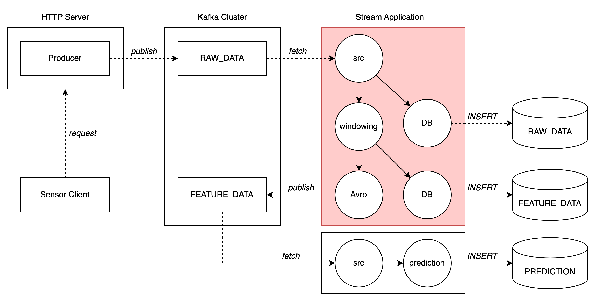
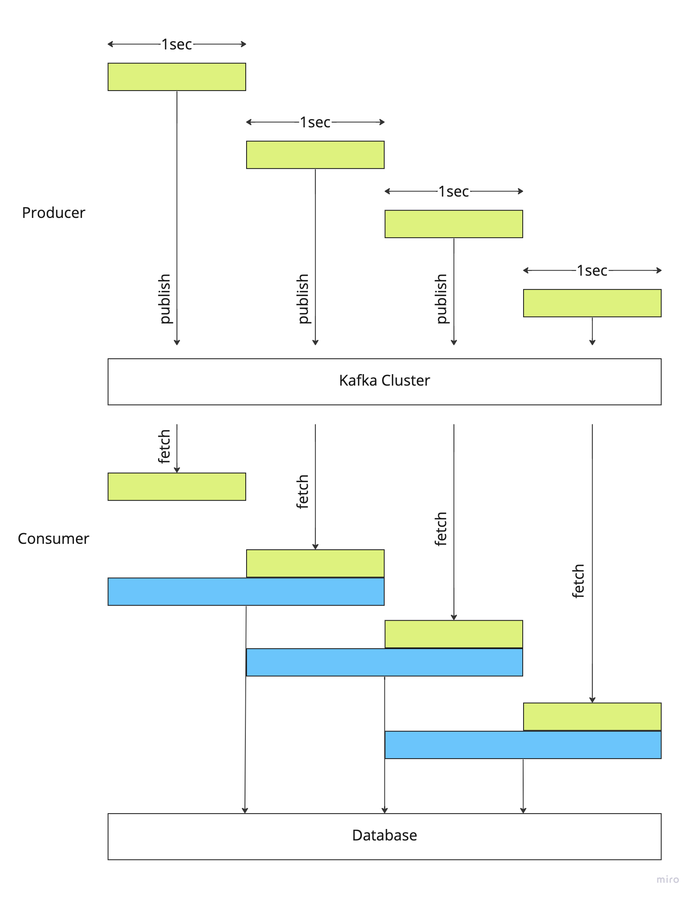
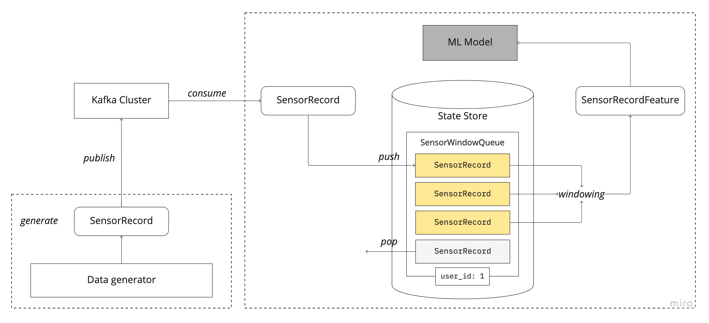

# Stream application for physiological sensor data

This project is for stream application in distributed real-time data processing system. The overall architecture is as follows:

* The red colored area is managed in this project.
* If you interested in [producer application](https://github.com/goomon/spring-kafka-publisher) or [simulation application](https://github.com/goomon/kafka-locust) part, feel free to visit.

## Configuration

For sliding window processing of given sensor data, two parameters are needed to set up. Those value can be found in _resources/application.yaml_ file.

1. `user.preprocess.window.overlap.ratio`(double) 
2. `user.preprocess.window.size`(long, ms)

The given example is window size 2000ms and overlap ratio is 0.5.

## Sliding window processing
* This project is mainly dependent on Kafka Streams library.
* By using `StateStore` which is memory cache(Rocks DB) in Kafka Stream.

* In `StateStore`, `SensorWindowQueue` is stored with the key value, user id.
* According to sliding window configuration, the queue conserve predefined number of `SensorRecord`.
  * Based on sampling rate, `SensorWindowTransformer` extract feature data from queue.